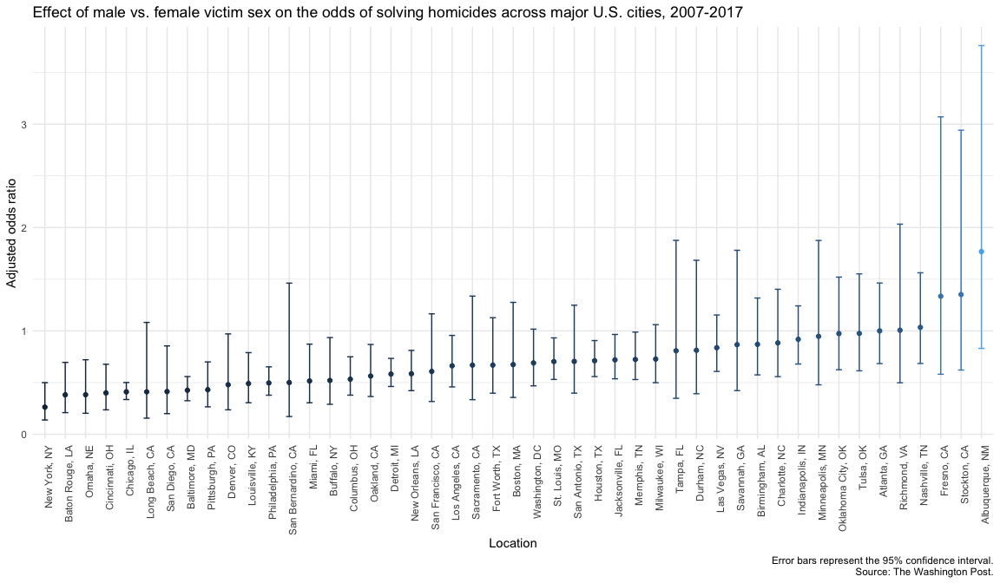

P8105 Homework 6
================
December 3rd, 2022

## Part 1: Central Park Weather Data

For this problem, we’ll use the 2017 Central Park weather data from the
`rnoaa` package. The code chunk below will download these data.

``` r
weather_df = 
  rnoaa::meteo_pull_monitors(
    c("USW00094728"),
    var = c("PRCP", "TMIN", "TMAX"), 
    date_min = "2017-01-01",
    date_max = "2017-12-31") %>%
  mutate(
    name = recode(id, USW00094728 = "CentralPark_NY"),
    tmin = tmin / 10,
    tmax = tmax / 10) %>%
  select(name, id, everything())
```

``` r
crossval_df = weather_df %>% 
  modelr::bootstrap(n = 100) %>% 
  mutate(
    models = map(strap, ~lm(tmax ~ tmin, data = .x)),
    results = map(models, broom::tidy)) %>% 
  select(-strap, -models) %>% 
  unnest(results) %>% 
  group_by(term) %>% 
  summarize(boot_se = sd(estimate))
```

## Part 2: Washington Post Homicide Data

### Load and clean data

The Washington Post has gathered data on homicides in 50 large U.S.
cities. Let’s load the raw homicide data and inspect it.

``` r
homicide_data = read_csv("data/homicide-data.csv") %>% 
  janitor::clean_names()
homicide_data
```

    ## # A tibble: 52,179 × 12
    ##    uid   repor…¹ victi…² victi…³ victi…⁴ victi…⁵ victi…⁶ city  state   lat   lon
    ##    <chr>   <dbl> <chr>   <chr>   <chr>   <chr>   <chr>   <chr> <chr> <dbl> <dbl>
    ##  1 Alb-…  2.01e7 GARCIA  JUAN    Hispan… 78      Male    Albu… NM     35.1 -107.
    ##  2 Alb-…  2.01e7 MONTOYA CAMERON Hispan… 17      Male    Albu… NM     35.1 -107.
    ##  3 Alb-…  2.01e7 SATTER… VIVIANA White   15      Female  Albu… NM     35.1 -107.
    ##  4 Alb-…  2.01e7 MENDIO… CARLOS  Hispan… 32      Male    Albu… NM     35.1 -107.
    ##  5 Alb-…  2.01e7 MULA    VIVIAN  White   72      Female  Albu… NM     35.1 -107.
    ##  6 Alb-…  2.01e7 BOOK    GERALD… White   91      Female  Albu… NM     35.2 -107.
    ##  7 Alb-…  2.01e7 MALDON… DAVID   Hispan… 52      Male    Albu… NM     35.1 -107.
    ##  8 Alb-…  2.01e7 MALDON… CONNIE  Hispan… 52      Female  Albu… NM     35.1 -107.
    ##  9 Alb-…  2.01e7 MARTIN… GUSTAVO White   56      Male    Albu… NM     35.1 -107.
    ## 10 Alb-…  2.01e7 HERRERA ISRAEL  Hispan… 43      Male    Albu… NM     35.1 -107.
    ## # … with 52,169 more rows, 1 more variable: disposition <chr>, and abbreviated
    ## #   variable names ¹​reported_date, ²​victim_last, ³​victim_first, ⁴​victim_race,
    ## #   ⁵​victim_age, ⁶​victim_sex

There are 52179 observations of 12 variables containing information
about homicides in 50 cities across the US. The data contains the date,
victim information (name, age, sex, race), location (city, state,
latitude, longitude), and status of the case.

Next, let’s tidy the data by creating a `city_state` variable, and
omitting Dallas, Phoenix, Kansas City, and Tulsa, AL (a data entry
error). We will also convert `victim_age` to a numeric variable, and
keep observations only where the victim’s race is White or Black.

``` r
homicide_data = homicide_data %>% 
  mutate(
    state = str_to_upper(state),
    city_state = str_c(city, state, sep = ", "), 
    victim_age = as.numeric(victim_age),
    resolved = as.numeric(disposition == "Closed by arrest")) %>% 
  filter(city_state != "Dallas, TX" & 
           city_state != "Phoenix, AZ" & 
           city_state != "Kansas City, MO" & 
           city_state != "Tulsa, AL", 
         victim_race == "White" | victim_race == "Black")
```

There are now 39693 observations of 14 variables in our cleaned dataset
containing information about homicides in 47 cities across the US.

### Modelling homicide data

Now run `glm` for each of the cities in your dataset, and extract the
adjusted odds ratio (and CI) for solving homicides comparing male
victims to female victims. Do this within a “tidy” pipeline, making use
of purrr::map, list columns, and unnest as necessary to create a
dataframe with estimated ORs and CIs for each city.

Create a plot that shows the estimated ORs and CIs for each city.
Organize cities according to estimated OR, and comment on the plot.

``` r
OR_df = homicide_data %>% 
  nest(data = -city_state) %>% 
  mutate(models = map(data, ~ glm(resolved ~ victim_age + victim_sex + victim_race, 
                                 data = ., family = "binomial")), 
         results = map(models, broom::tidy)) %>% 
  select(-data, -models) %>% 
  unnest(results) %>% 
  mutate(OR = exp(estimate),
         CIL = exp(estimate - 1.96*std.error),
         CIU = exp(estimate + 1.96*std.error)) %>% 
  filter(term == "victim_sexMale") %>% 
  select(city_state, term, log_OR = estimate, OR, CIL, CIU, p.value) 
```

``` r
OR_df %>% 
  mutate(city_state = fct_reorder(city_state, OR)) %>% 
  ggplot(aes(x = city_state, y = OR, colour = OR)) + 
  geom_point() + 
  geom_errorbar(aes(ymin = CIL, ymax = CIU, width = .3)) + 
  theme(axis.text.x = element_text(angle = 90, hjust = 1), 
        legend.position = "none") + 
  labs(
    x = "Location",
    y = "Adjusted odds ratio",
    title = "Effect of male vs. female victim sex on the odds of solving homicides across major U.S. cities, 2007-2017",
    caption = paste0(
          "Error bars represent the 95% confidence interval.",
          "\nSource: The Washington Post."))
```

<!-- -->
